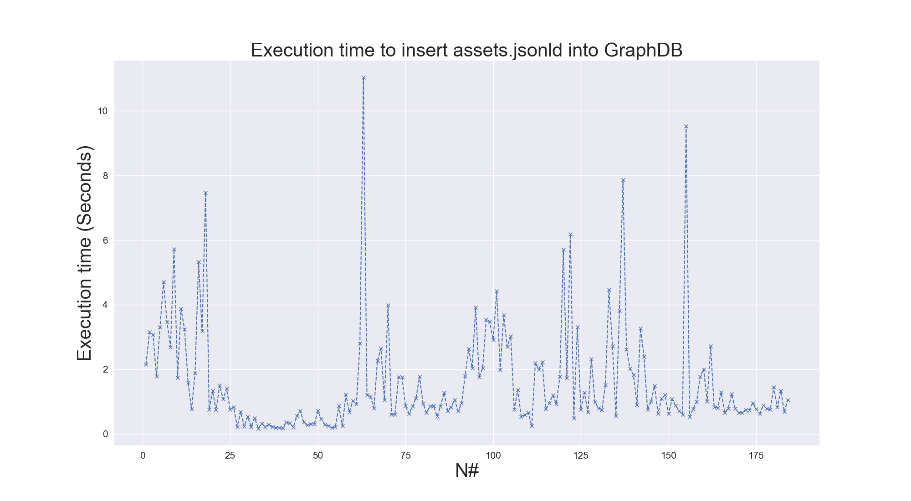
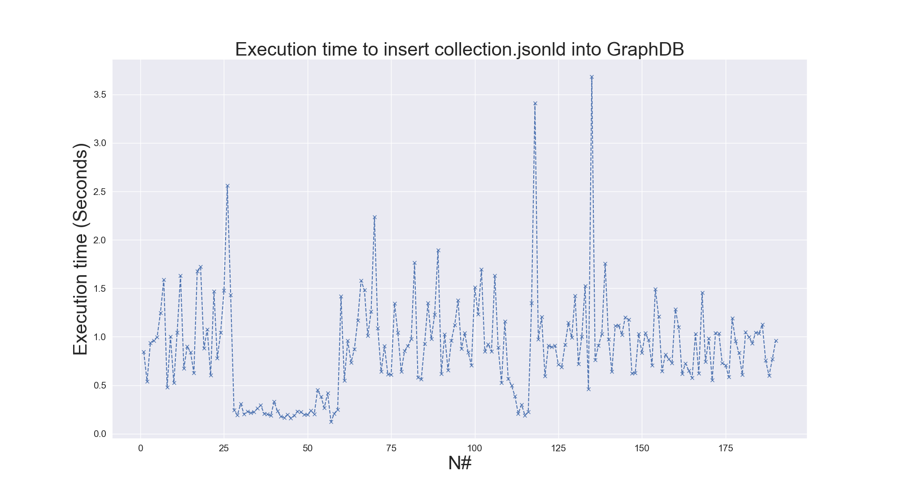
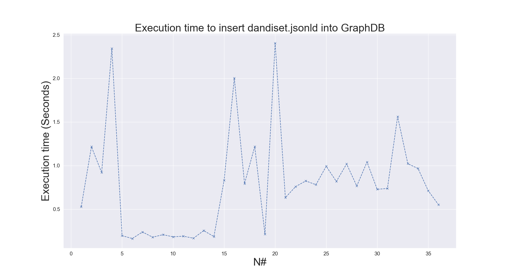

# Benchmarking
## _Performance benchmarking of GraphDB_

This repository contains the code to benchmark the insert and fetch (or get) operation on GraphDB.

## Test System Configuration

- RAM: 16GB RAM
- Processor: 2,8 core 3 GHz Quad-Core Intel Core i7 processor
- Storage: 500GB
- OS: macOS
- GraphDB 10.6.2 (_Free tier_) • RDF4J 4.3.9 • Connectors 16.2.6 • Workbench 2.6.2 

## Insert Operation

Peformance for insert operation:

# To-Do List

- [x] Develop code to retrieve JSON-LD data from an S3 bucket
- [x] Add fetched json-ld data to GraphDB
- [x] Benchmark performance of insert operation
- [ ] Develop code to retrieve data from GraphDB
- [ ] Benchmark performance of retrieving data from GraphDB
- [ ] Transform all codes from Jupyter notebook to Python scripts and a complete end-to-end pipeline 

