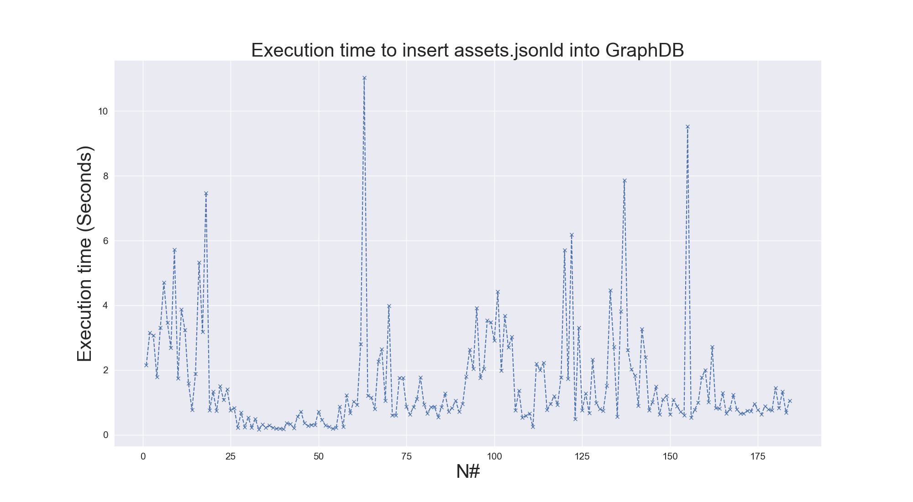
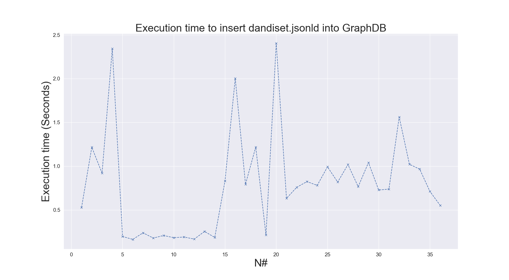
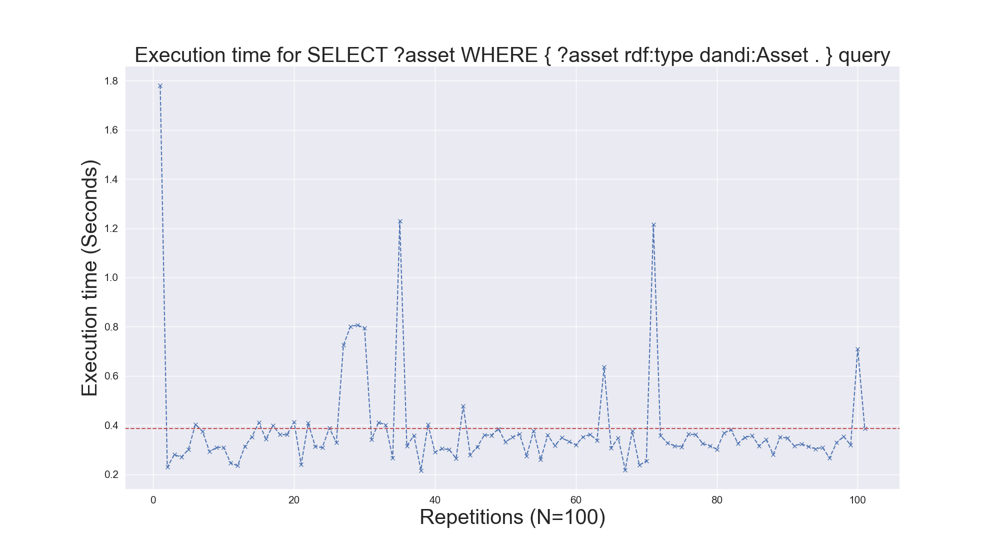

# Benchmarking
## _Performance benchmarking of GraphDB_


This repository contains the code to benchmark the insert and fetch (or get) operation on GraphDB.


## Test System Configuration

- RAM: 16GB RAM
- Processor: 2,8 core 3 GHz Quad-Core Intel Core i7 processor
- Storage: 500GB
- OS: macOS
- GraphDB 10.6.2 (_Free tier_) • RDF4J 4.3.9 • Connectors 16.2.6 • Workbench 2.6.2 


## Insert Operation

### Peformance for insert operation:




### Peformance for fetch (or get) operation:
- Test 1:
    ```sparql
        SELECT ?asset 
        WHERE {
            ?asset rdf:type dandi:Asset .
        }
    ```
    
- Test 2:
    
  ```sparql
    SELECT ?asset ?path ?d ?size ?format
    WHERE {
        ?asset rdf:type dandi:Asset .
        ?d prov:hasMember ?asset .
        ?asset dandi:path ?path ;
           schema:contentSize ?size ;
           schema:encodingFormat ?format .
    }
    ```
  

    
- Test 3:
  ```sparql
        SELECT DISTINCT ?sub_id ?d ?gen ?spc ?age
        WHERE {
            ?asset rdf:type dandi:Asset .
            ?d prov:hasMember ?asset .
            ?asset prov:wasAttributedTo ?sub .
            ?sub rdf:type dandi:Participant ;
                  dandi:genotype ?gen ;
                  schema:identifier ?sub_id ;
                  dandi:species / schema:name ?spc ;
                  dandi:age / schema:value ?age .
        }
    ```
    
    

# To-Do List

- [x] Develop code to retrieve JSON-LD data from an S3 bucket
- [x] Add fetched json-ld data to GraphDB
- [x] Benchmark performance of insert operation
- [x] Develop code to retrieve data from GraphDB
- [x] Benchmark performance of retrieving data from GraphDB
- [ ] Transform all codes from Jupyter notebook to Python scripts and a complete end-to-end pipeline 


